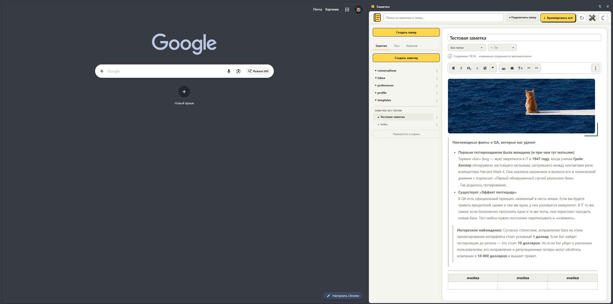

# Заметки

Расширение для браузера: личные Markdown-заметки, которые хранятся только на вашем диске — в выбранной вами папке `.md`-файлов. Визуальный редактор (жирный, курсив, заголовки, списки, задачи, цитаты), теги, поиск по названию/тексту/тегам/пути и корзина с восстановлением. Аккаунта, сервера синхронизации и аналитики нет; редактор собран локально и не обращается к CDN.



## Совместимость

| Браузер | Поддержка |
| --- | --- |
| Google Chrome | ✅ Работает, протестировано |
| Microsoft Edge, Brave, Opera и другие Chromium-браузеры | ⚠️ Не тестировалось (должно работать, так как использует стандартный Manifest V3 и Chrome API) |
| Firefox, Safari | ❌ Не поддерживается |

## Установка

Расширение не публикуется в Chrome Web Store — устанавливается вручную, как распакованное расширение. Редактор Tiptap уже собран в `app/vendor/editor.js`, поэтому Node.js и сборка не нужны — понадобится только Git (или можно скачать ZIP без него, см. шаг 1).

1. Склонируйте репозиторий:

   ```
   git clone https://github.com/Pauelbel/my-browser-notes-ext.git
   ```

   Вместо этого можно скачать код без Git: на странице репозитория на GitHub нажать «Code» → «Download ZIP» и распаковать архив.
2. Откройте в Chrome страницу `chrome://extensions`.
3. Включите переключатель «Режим разработчика» (в правом верхнем углу страницы).
4. Нажмите «Загрузить распакованное расширение».
5. В открывшемся диалоге выберите папку `app` внутри склонированного/распакованного репозитория (например, `my-browser-notes-ext/app`) и подтвердите выбор.
6. Расширение появится в списке и в панели расширений Chrome (значок пазла в тулбаре) — закрепите его, если нужен быстрый доступ.
7. Откройте расширение (значок в тулбаре или боковая панель) — при первом запуске оно попросит выбрать папку на диске, где будут храниться заметки в виде `.md`-файлов.

### Обновление

Чтобы обновить расширение после изменений в папке `app/`, откройте `chrome://extensions` и нажмите «Обновить» на карточке расширения, затем заново откройте панель. Не удаляйте расширение из Chrome — удаление стирает его локальные данные (последнюю открытую заметку, положение панели и т. п.); сами заметки при этом не пострадают, так как они хранятся в выбранной папке на диске.

## Разработка

Всё, включая инструменты разработки, лежит в [app/](app/) — это же и есть папка, которую грузят в Chrome. Редактор Tiptap уже собран в `app/vendor/editor.js`, так что для установки расширения Node.js не нужен. Команды ниже выполняются из папки `app/`:

- `pnpm install --frozen-lockfile` — установить зависимости сборки.
- `node build.mjs` — пересобрать `vendor/editor.js` из `editor-source.js`.
- `node --test tests/*.test.js` — тесты файлового слоя, тегов и архивации.
- `node serve.mjs` — локальный сервер на `http://127.0.0.1:4173/index.html` для проверки без установки расширения (использует изолированную тестовую коллекцию OPFS, а не ваши файлы).

Лицензии зависимостей перечислены в `app/vendor/THIRD_PARTY_NOTICES.txt`.
